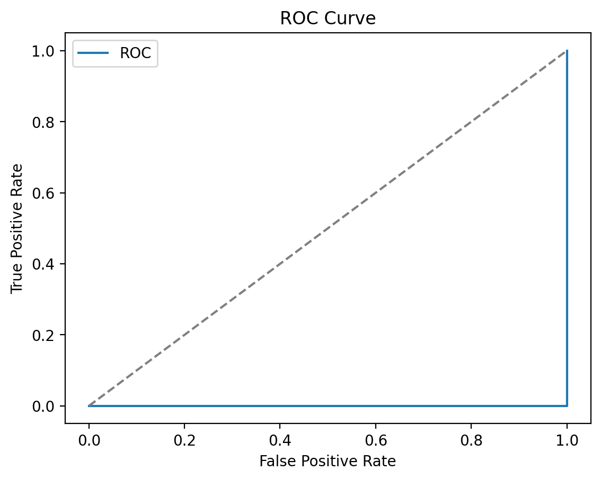
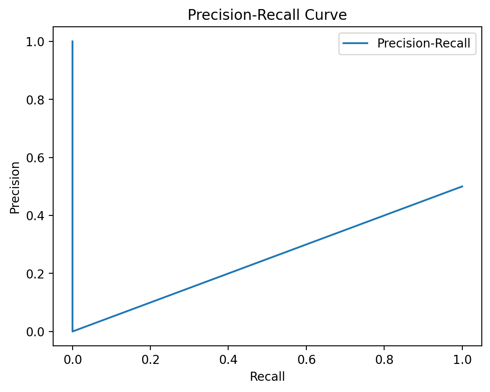

# QSAR Bioactivity Pipeline (ECFP vs MACCS, RF vs XGBoost)

End-to-end QSAR pipeline for binary bioactivity prediction, built in Python with RDKit and scikit-learn.
It compares different molecular representations and models, handles class imbalance, and demonstrates a realistic hit triage use case.
This project was designed as an industry-style chemoinformatics portfolio project.

## 🔍 Features

* **Data handling**: Load CSV assay data, basic cleaning (dropna, cast activity to int, remove duplicate SMILES).
* **Featurization (RDKit)**: ECFP-like Morgan fingerprints and MACCS keys.
* **Models**: Random Forest (`class_weight='balanced'`) and XGBoost.
* **Evaluation**: ROC-AUC, PR-AUC (optimized with threshold @ 0.15 for imbalanced classes), Brier score, and Confusion Matrix.
* **Hit triage**: Rank test-set molecules by predicted probability of being active and export top-N compounds.

## 📂 Project structure
your-repo/
├── data/
│   └── toy_assay.csv              # small demo dataset (SMILES + activity)
├── outputs_experiments/           # example outputs from experiments.py
├── outputs_triage/                # example outputs from triage.py
├── src/
│   ├── data_utils.py
│   ├── featurization.py
│   ├── model.py
│   ├── eval.py
│   ├── plotting.py
│   ├── pipeline.py

│   └── experiments.py

├── requirements.txt
└── README.md
## 📊 Results & Evaluation

### Best Model Performance (RF Morgan)
Qui sotto puoi vedere i grafici aggiornati generati dalla pipeline con la soglia ottimizzata a 0.15:

