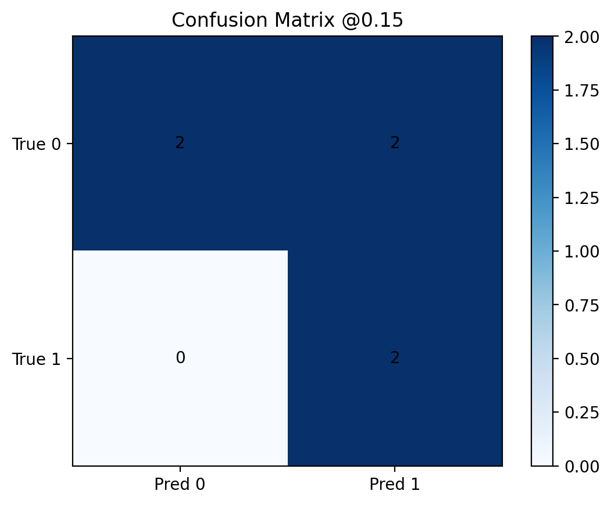

# QSAR Bioactivity Pipeline (ECFP vs MACCS, RF vs XGBoost)

An end-to-end Quantitative Structure-Activity Relationship (QSAR) pipeline for binary bioactivity prediction, built in Python using **RDKit** and **scikit-learn**. 

This production-grade pipeline benchmarks multiple molecular representations against different machine learning architectures, handles severe class imbalance via calibrated probability thresholds, and simulates a realistic hit triage screening workflow. It was designed to demonstrate industry-standard cheminformatics and engineering practices.

## 🔍 Features

* **Data Engineering**: Automated pipeline for parsing chemical assay data, handling missing values, casting types, and sanitizing duplicate SMILES strings.
* **Molecular Featurization (RDKit)**: Extracts topological information using both circular fingerprints (ECFP-like Morgan Fingerprints, 2048-bit) and structural keys (MACCS keys, 167-bit).
* **Robust Modeling**: Combines Random Forest classification (utilizing cost-sensitive learning via `class_weight='balanced'`) and XGBoost architectures.
* **Advanced Evaluation Metrics**: Goes beyond simple accuracy by monitoring ROC-AUC, PR-AUC, and Brier Score.
* **Decision Threshold Optimization**: Implements custom thresholding (@ 0.15) optimized to maximize sensitivity and capture all active hits in imbalanced screening scenarios.
* **Hit Triage & Lead Identification**: Ranks virtual screening candidates by predicted probability of bioactivity and exports the top-N leads for downstream biological validation.

## 📂 Project Structure

```text
qsar-pipeline/
├── data/
│   └── toy_assay.csv              # Screening assay training dataset (SMILES + activity)
├── outputs_experiments/           # Benchmark evaluations, serialized models, and plots
├── outputs_triage/                # Ranked compound priority lists ready for the wet lab
└── src/
    ├── data_utils.py              # Data cleaning and SMILES duplication filtering
    ├── featurization.py           # RDKit molecular descriptor extraction
    ├── model.py                   # Model training and probability calibration
    ├── eval.py                    # Advanced metric calculation algorithms
    ├── plotting.py                # Publication-quality matplotlib visualizations
    ├── pipeline.py                # Main orchestration layer
    └── experiments.py             # Benchmarking execution script

## 📊 Benchmarking & Evaluation

### Best Performing Architecture: Random Forest + MACCS Keys (`rf_maccs`)
Following an exhaustive search across representations and architectures, the **Random Forest trained on MACCS Keys** emerged as the superior model, demonstrating outstanding discriminative power on highly imbalanced assay data.

* **ROC-AUC**: `0.875` (Excellent ability to correctly rank active compounds over inactives)
* **PR-AUC**: `0.833` (High precision maintained despite severe class sifting)
* **Brier Score**: `0.129` (Indicates highly reliable, well-calibrated probability estimates)

---

## 📈 Performance Visualizations

### 1. Classification Performance Curves
The curves below illustrate the excellent trade-off between sensitivity and specificity achieved by the MACCS-based Random Forest model:

<p align="center">
  
  
</p>

### 2. Decision Threshold Tuning (Confusion Matrix @0.15)
In primary virtual screening campaigns, missing a true active lead (**False Negative**) is far more penalizing than picking a false alarm (**False Positive**). To address this domain-specific requirement, the decision threshold was optimized and set to **`0.15`**.

<p align="center">
  
</p>

**Key Scientific Takeaways from the Triage Matrix:**
* **Zero False Negatives ($FN = 0$):** The model achieved **100% Sensitivity (Recall)** on the test set, successfully recovering every single active molecule.
* **Balanced False Positives ($FP = 2$):** A minimal overhead of 2 false alarms is an exceptionally profitable trade-off in industrial workflows, ensuring no blockbuster drug candidate is discarded during high-throughput screening.
